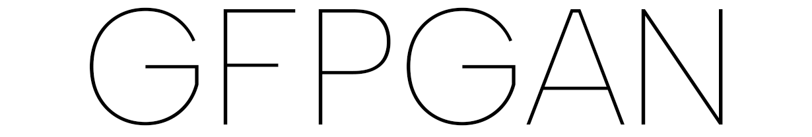
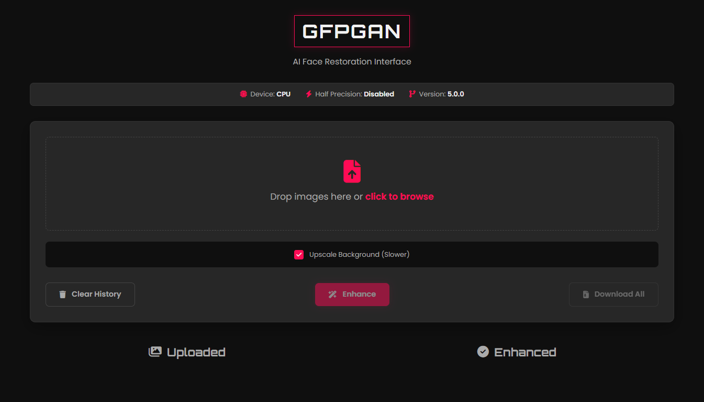

<div align="center">
  
  <h1>GFPGAN Web UI</h1>
  <p>A powerful, user-friendly desktop web interface for the GFPGAN and Real-ESRGAN models, designed for easy setup and use.</p>
</div>

<div align="center">
  
</div>

## 🗂 Table of Contents

- [📖 Introduction](#-introduction)
- [✨ Features](#-features)
- [🛠️ Installation](#️-installation)
- [💻 Usage](#-usage)
- [🤝 Contributing](#-contributing)
- [📜 License](#-license)

---

## 📖 Introduction

This project provides a clean, modern, and easy-to-use web interface for enhancing images using state-of-the-art AI models. It leverages the powerful face restoration capabilities of [**GFPGAN**](https://github.com/TencentARC/GFPGAN) and the versatile background upscaling of [**Real-ESRGAN**](https://github.com/xinntao/Real-ESRGAN) to dramatically improve image quality.

The application is designed for simplicity, featuring an automated setup script for Windows and a lazy-loading architecture that ensures a fast startup and efficient memory usage.

---

## ✨ Features

- 🚀 **Automated 1-Click Setup:** A smart `run.bat` script for Windows automatically finds conda, creates the environment, and installs all dependencies.
- ⚡ **Lazy Model Loading:** The application starts instantly. Models are only loaded into memory on the first enhancement task, preventing startup crashes on low-RAM systems.
- 💡 **Performance Control:** A dedicated **"Upscale Background"** checkbox allows users to disable the slower Real-ESRGAN process for much faster face-only restoration on CPU.
- 🖥️ **Modern Web Interface:** A sleek, responsive interface built with a cyberpunk aesthetic that is easy to navigate.
- 🖱️ **Drag and Drop:** Effortlessly upload multiple images by dragging them onto the application window.
- 🖼️ **Batch Processing:** Enhance multiple images at once and download them conveniently as a single ZIP archive.
- 🔍 **Side-by-Side Previews:** Immediately compare your original and enhanced images directly in the browser.

---

## 🛠️ Installation

### 📋 Prerequisites

- **OS:** Windows, Linux, or macOS.
- **Conda:** [Anaconda](https://www.anaconda.com/download) or [Miniconda](https://docs.conda.io/en/latest/miniconda.html) must be installed.
- **Git:** Required to clone the repository. [Install Git](https://git-scm.com/).
- **NVIDIA GPU (Optional):** For significantly faster processing.

### 💾 Setup Instructions

#### For Windows Users (Easy 1-Click Method)

This is the recommended method for Windows.

1.  **Clone the Repository:**
    ```bash
    git clone https://github.com/Md-Siam-Mia-Man/GFPGAN.git
    cd GFPGAN
    ```
2.  **Run the Script:**
    Simply double-click the `run.bat` file.
    - The script will automatically detect your hardware and guide you through a one-time setup process to create the environment and install all dependencies.
    - On future runs, it will skip the setup and launch the app directly.

#### Manual Installation (For Linux, macOS, and advanced users)

1.  **Clone the Repository:**
    ```bash
    git clone https://github.com/Md-Siam-Mia-Man/GFPGAN.git
    cd GFPGAN
    ```
2.  **Create and Activate Conda Environment:**
    ```bash
    conda create -n GFPGAN python=3.7 -y
    conda activate GFPGAN
    ```
3.  **Install PyTorch:**
    - **For NVIDIA GPU (Recommended):** Find your CUDA version with `nvidia-smi` and run the appropriate command. For example, for CUDA 11.8:
      ```bash
      conda install pytorch torchvision torchaudio pytorch-cuda=11.8 -c pytorch -c nvidia -y
      ```
    - **For CPU Only:**
      ```bash
      conda install pytorch torchvision torchaudio cpuonly -c pytorch -y
      ```
4.  **Install Other Dependencies:**
    ```bash
    pip install -r requirements.txt
    ```

---

## 💻 Usage

### ▶️ Running the Application

- **Windows:** Double-click `run.bat`.
- **Manual Start (All OS):**
  1.  Activate the conda environment: `conda activate GFPGAN`
  2.  Run the application: `python app.py`

### 🌐 Accessing the Web Interface

Open your favorite web browser and navigate to:
**[http://127.0.0.1:3005](http://127.0.0.1:3005)**

### 📝 How to Use

1.  **Upload Images:** Drag and drop your images (`.jpg`, `.png`) onto the designated area or click to browse.
2.  **Set Options:**
    - Check the **"Upscale Background"** box for the highest quality (slower).
    - Uncheck it for fast, face-only restoration (recommended for CPU users).
3.  **Enhance:** Click the "Enhance" button.
    - **Note:** The very first enhancement will be slow as the AI models are loaded into memory for the first time. Subsequent runs will be much faster.
4.  **Download:** Save your enhanced images individually from the preview, or click "Download All" to get a `.zip` file.
5.  **Clear:** Click "Clear History" to remove all uploaded and enhanced images from the server.

---

## 🤝 Contributing

Contributions, issues, and feature requests are welcome! Feel free to check the [issues page](https://github.com/Md-Siam-Mia-Man/GFPGAN/issues).

1.  Fork the repository.
2.  Create your feature branch (`git checkout -b feature/AmazingFeature`).
3.  Commit your changes (`git commit -m 'Add some AmazingFeature'`).
4.  Push to the branch (`git push origin feature/AmazingFeature`).
5.  Open a Pull Request.

---

## 📜 License

This project's Web UI and automation scripts are open-source. The core AI models and restoration algorithms are provided by the original creators:

- **GFPGAN:** [TencentARC](https://github.com/TencentARC/GFPGAN)
- **Real-ESRGAN:** [xinntao](https://github.com/xinntao/Real-ESRGAN)

Please adhere to their respective licenses when using or distributing the models.

---

<div align="center">
  <h3>❤️ Happy Enhancing! ❤️</h3>
</div>
